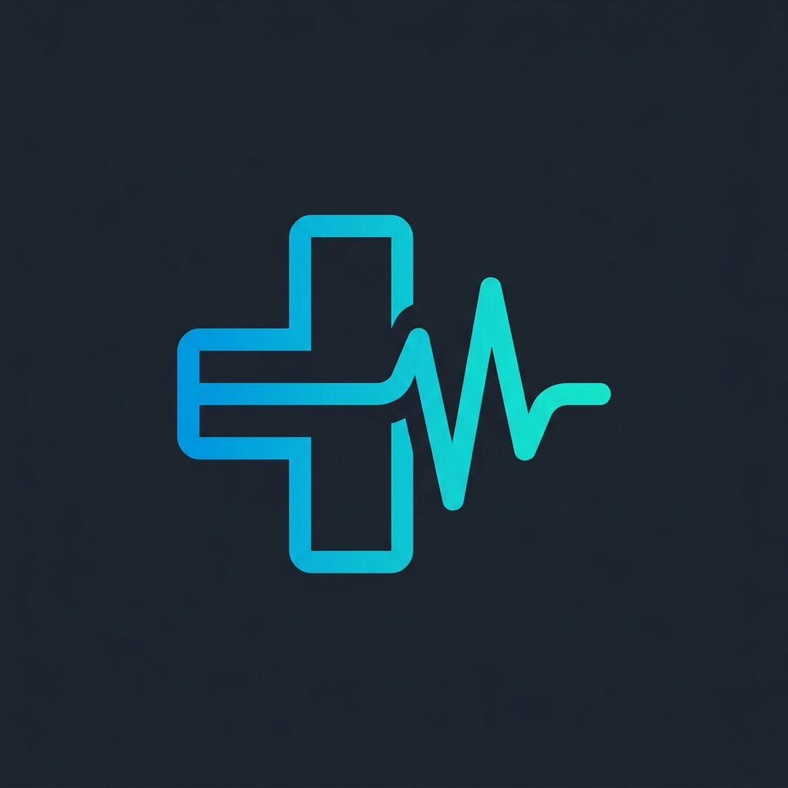
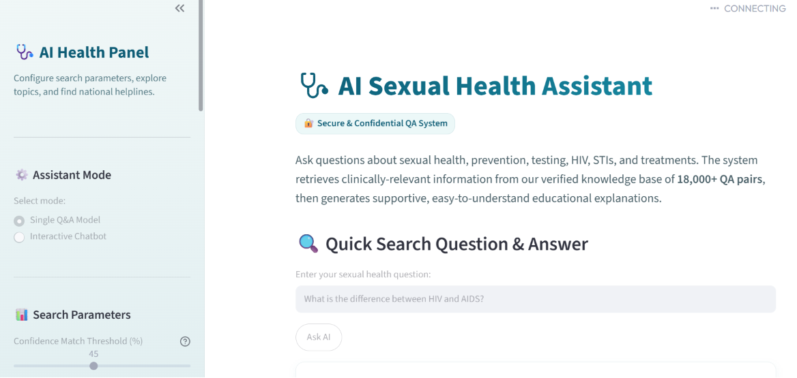
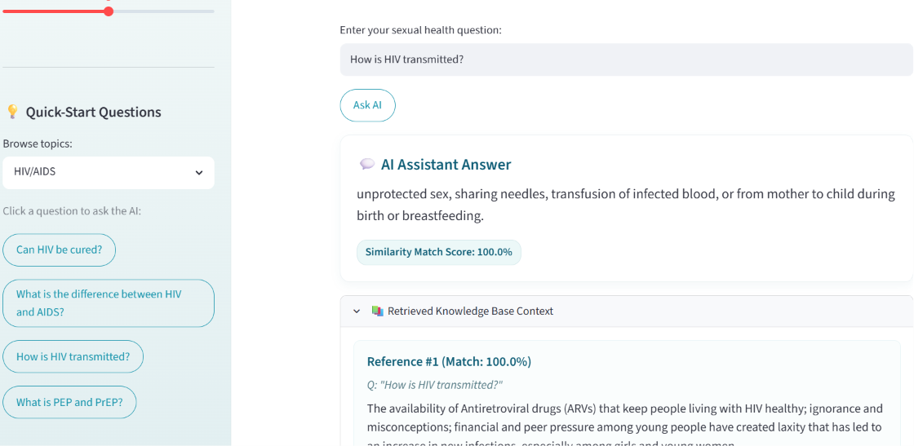

#  AI Sexual Health Information Assistant

An interactive, Retrieval-Augmented Generation (RAG) web application designed to provide secure, confidential, and accurate sexual health education. The system combines semantic similarity search over a curated knowledge base of **18,000+ QA pairs** with the transformer-based **FLAN-T5** model to generate clear, context-aware answers.

---

## 📸 Screenshots

Here is a visual look at the application's clean, modern interface:

| Home Dashboard | Question & Answer Search |
| :---: | :---: |
|  |  |

---

## 🌟 Features

* **Dual Interface Modes:**
  * **Quick Search Q&A:** Get direct, single-turn responses alongside specific reference passages, matching scores, and relevant knowledge base entries.
  * **Interactive Chatbot:** A multi-turn conversational interface with session history memory.
* **Semantic Search Pipeline:** Uses `all-MiniLM-L6-v2` embeddings combined with a **FAISS** index for high-speed, cosine-similarity matching of user queries.
* **Configurable Controls:**
  * **Confidence Match Threshold:** Adjust the minimum similarity match required to generate an answer, filtering out unrelated questions.
  * **Top-K Context Size:** Control the number of reference texts provided as context to the generator.
* **Interactive Quick-Start Topics:** Clickable sample queries for HIV/AIDS, STIs, testing, prevention, and care.
* **Confidential & Educational:** Secure interface containing integrated support hotlines, helpline links, and a strict medical disclaimer callout.
* **Modern Premium Styling:** Custom CSS layout, hover micro-animations, card designs, and compatibility with system dark/light modes.

---

## 🛠️ Architecture

```
User Question
     │
     ▼
┌─────────────────────────┐
│ SentenceTransformer     │  (all-MiniLM-L6-v2)
│ [Query Embedding]       │
└────────────┬────────────┘
             │
             ▼
┌─────────────────────────┐
│ FAISS Vector Index      │  (Similarity Search over 18,000+ QA pairs)
│ [Top-K Passage Retrieval]│
└────────────┬────────────┘
             │
             ▼
┌─────────────────────────┐
│ Contextual prompt       │  (Filters matches below Confidence Threshold)
│ [Instruction Template]  │
└────────────┬────────────┘
             │
             ▼
┌─────────────────────────┐
│ FLAN-T5-Base LLM        │  (Sequence-to-sequence response generation)
│ [Synthesized Answer]    │
└────────────┬────────────┘
             │
             ▼
       Final Response
```

---

## 📂 Project Structure

```
AI-Sexual-Health-Assistant/
│
├── app.py                 # Main Streamlit web application
├── requirements.txt       # Dependencies
├── README.md              # Project documentation
│
├── assets/                # Design assets
│   ├── logo.png           # App logo
│   └── screenshots/       # App UI screenshots
│       ├── home.png
│       └── answer.png
│
├── components/            # UI components
│   ├── chat.py            # Chatbot layout and session history
│   ├── disclaimer.py      # Medical disclaimer banner
│   ├── footer.py          # Credential & tech metadata footer
│   ├── hero.py            # Welcome banner
│   ├── sidebar.py         # Left UI Sidebar controls & resource cards
│   └── styles.py          # Custom CSS stylesheets
│
├── models/                # FAISS Index and pickled Knowledge Base
│   ├── health_index.faiss # Indexed question embeddings
│   └── knowledge_base.pkl # QA pair dataframe
│
└── src/                   # AI pipeline modules
    ├── generator.py       # FLAN-T5 prompt formatting and generation
    ├── pipeline.py        # Search and generation orchestration
    └── retrieval.py       # FAISS database query execution
```

---

## 💻 Local Installation & Setup

1. **Clone the Repository:**
   ```bash
   git clone https://github.com/your-username/AI-Sexual-Health-Assistant.git
   cd AI-Sexual-Health-Assistant
   ```

2. **Run Using Your Shell:**

   * **In PowerShell (Windows):**
     * Option A (Activate first):
       ```powershell
       .\venv\Scripts\Activate.ps1
       streamlit run app.py
       ```
     * Option B (Direct execute):
       ```powershell
       .\venv\Scripts\streamlit run app.py
       ```

   * **In Git Bash / WSL / Linux (Bash):**
     * Option A (Activate first):
       ```bash
       source venv/Scripts/activate
       streamlit run app.py
       ```
     * Option B (Direct execute):
       ```bash
       ./venv/Scripts/streamlit run app.py
       ```


## 🧑‍💻 Technical Details & Stack

* **Front-End Framework:** Streamlit (v1.58.0)
* **Embeddings Model:** `sentence-transformers/all-MiniLM-L6-v2` (384-dimensional dense vectors)
* **Vector Store:** Facebook AI Similarity Search (`FAISS CPU`)
* **Generator Model:** Google's `FLAN-T5 Base` (248M parameters text-to-text transformer)
* **Data Processing:** Pandas, NumPy, PyTorch

---

## 🛡️ Disclaimer
This system is an AI-powered educational reference. It does not provide clinical diagnosis or professional medical treatment. Always consult a certified healthcare professional or contact national support helplines (e.g., CDC-INFO) for medical decisions.
